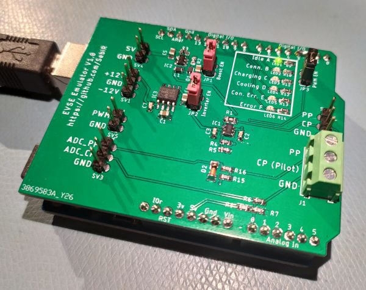

# EVSE Emulator Arduino Shield
An Arduino shield to emulate an EVSE (Electric Vehicle Supply Equipment), so basically it emulates a car charger

## Features
* on-board charge pump and inverter for +12/-12V pilot signal
* Pilot level and PP level go to ADC channels
* Status LEDs

## Firmware
The Firmware is still in progress. It will be documented once finished

### Known Issues
* ADC values are dependent from USB voltage

## Resources
https://www.goingelectric.de/wiki/Typ2-Signalisierung-und-Steckercodierung/

## Disclaimer
This project was created to test an EV emulator. This project is not intended to be used in an actual Wallbox. 
There are no safety features and neither the firmware nor the hardware are created with robustness and safety in mind.
Although the state machine would be able to work as a full EVSE.

Use at your own risk. Im not liable for burning houses, cars or pants.