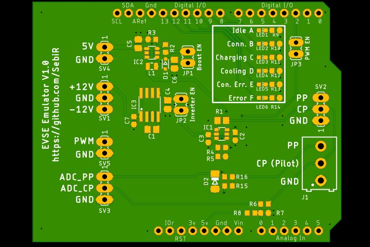

# EVSE Emulator Arduino Shield
An Arduino shield to emulate an EVSE (Electric Vehicle Supply Equipment), so basically it emulates a car charger

## Features
* on-board charge pump and inverter for +12/-12V pilot signal
* Pilot level and PP level go to ADC channels
* Status LEDs

# Firmware
The Firmware is still in progress. It will be documented once finished